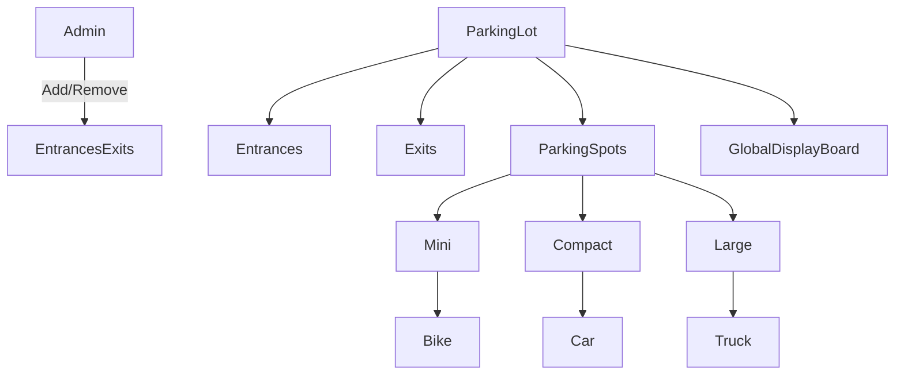
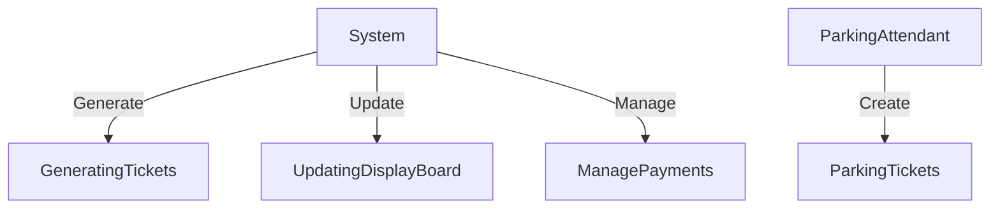
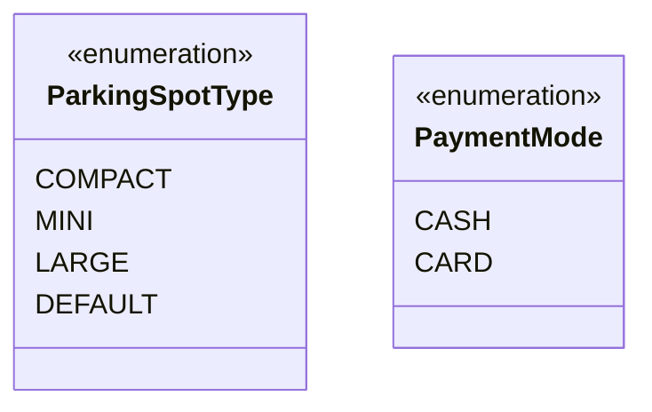
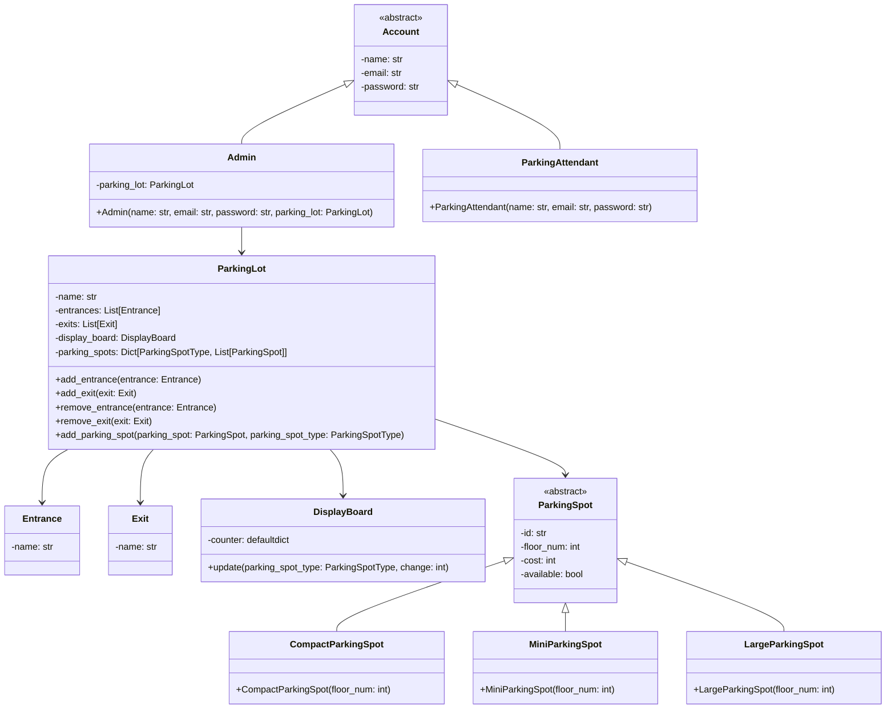
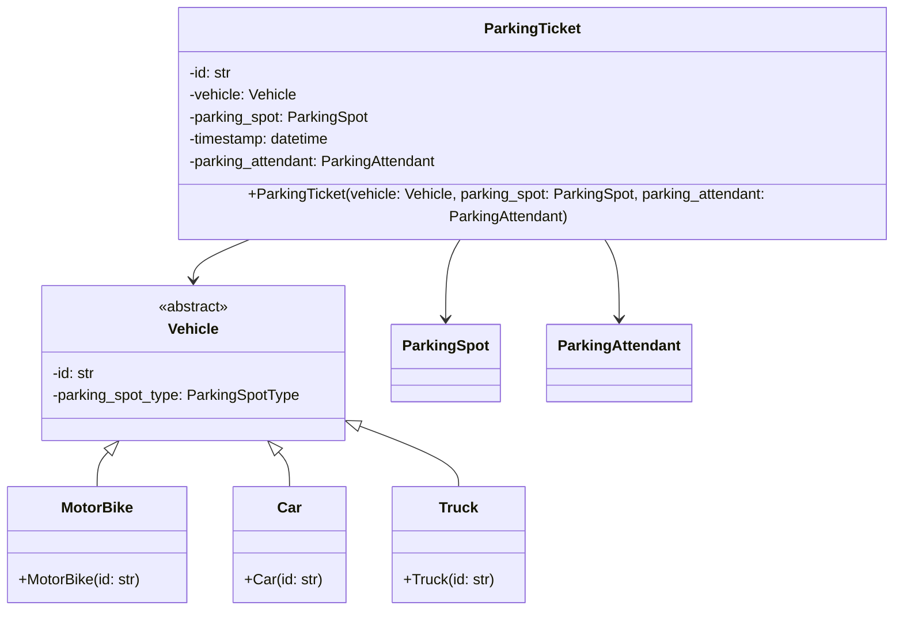
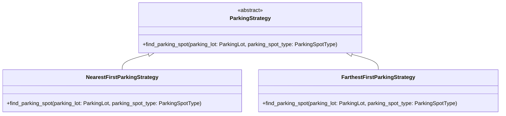
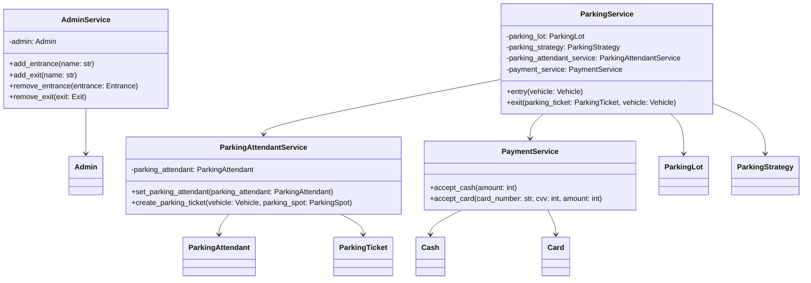

# Parking Lot
## Problem
Design a low-level system for a parking lot that satisfies the following requirements:
- The parking lot should have multiple entrances and exits.
- A global display board should show the number of free parking spots of all types.
- The parking lot should have different types of parking spots (mini, compact, and large) that allow parking for motorbikes, cars, and trucks, respectively.
- The parking lot should have multiple floors.
- The admin should be able to add and remove entrances and exits.
- The parking attendant should be able to create parking tickets.
- The parking lot should support different parking strategies like nearest first or farthest first on te basis of floor number and id of the parking spot.
- The parking lot should support different means of payment.

Please provide a detailed low-level design for the parking lot system that can handle the above requirements. 
You should consider how the parking lot will handle incoming and outgoing vehicles, track parking spots, generate and process parking tickets, and manage payments. 
Additionally, you should consider how the system will communicate with the display board and handle different parking strategies.

## Use-Case Diagram

## Class Diagram
### Enum Classes

### Core Classes

### Vehicle Group and Parking Ticket

### Parking Strategy Group

### Services

## Solving the Problem
- Set Up the Parking Lot:
  - Initialize ParkingLot, Entrance, Exit, DisplayBoard, and different types of ParkingSpot.
- Admin Operations:
  - Admin can add or remove entrances and exits using AdminService.
  - Admin can add parking spots to the parking lot.
- Vehicle Entry:
  - A vehicle arrives at the entrance.
  - Parking strategy (nearest or farthest first) finds an available parking spot.
  - Parking attendant creates a parking ticket.
  - Display board is updated to reflect the new status of parking spots.
- Vehicle Exit:
  - Vehicle presents the parking ticket.
  - System validates the ticket and the vehicle.
  - Parking spot is marked as available.
  - Display board is updated.
  - Payment is processed through PaymentService.
- Payment:
  - Payment can be made using cash or card.
  - PaymentService handles the payment transaction.
