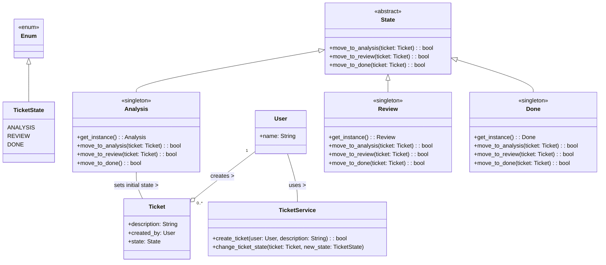

# Ticket Transition App
## Problem:
The problem at hand is to design a ticket management system where a ticket can transition through multiple states (Analysis, Review, Done) based on certain actions. The state of a ticket can be changed by a user, and these changes need to be managed in a systematic and controlled manner.

## Logic:
The given code represents a classic case of a **Finite State Machine (FSM)** in which there are defined states and transitions. It follows the State Design Pattern, with `Ticket` being the context class and `State`, `Analysis`, `Review`, and `Done` being the state classes. 
The state of a ticket is stored in `Ticket.state`, and can be changed by calling the `move_to_*` methods on the current state.

The `Analysis`, `Review`, and `Done` classes are implemented as singletons, meaning that only one instance of each class exists at any time. This is because the state transition logic for each state is the same for all tickets, so there is no need to create multiple instances of each state class.

The `TicketService` class provides a way to create a new ticket and to change the state of an existing ticket.

## Class Diagram

### Why the State Design Pattern fits here:
The `State Design Pattern` is a behavioral design pattern that allows an object to change its behavior when its internal state changes. 
This pattern fits perfectly in the current scenario for the following reasons:
- **State-specific logic is encapsulated in the state classes:** The logic for moving from one state to another is encapsulated in the individual state classes (`Analysis`, `Review`, `Done`). This makes the code easier to understand and maintain, as the logic for each state is kept separate.
- **The system can easily be extended to support new states:** If a new state needs to be added in the future (for example, a `Testing` state), it can be done by adding a new state class and implementing the required transition methods. This wouldn't require changes to the existing state classes or the `Ticket` class.
- **The context class (`Ticket`) remains simple:** The `Ticket` class doesn't need to know about the specific transition logic. It just delegates the transition to the current state object. This keeps the Ticket class simple and focused on its primary responsibility, which is to maintain the current state and delegate state transitions.
